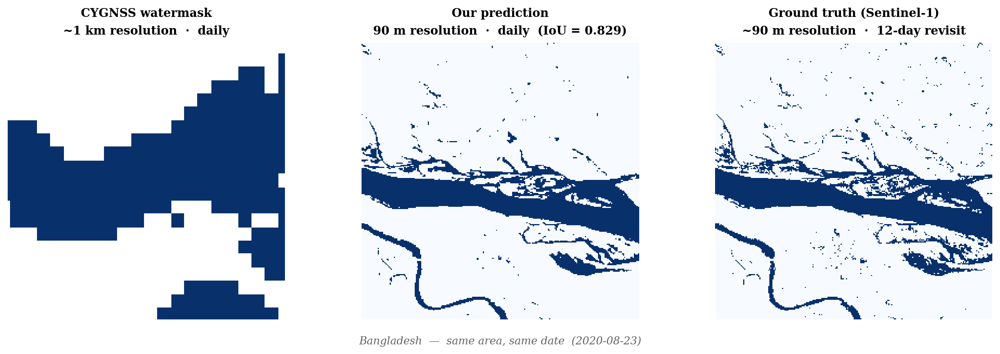
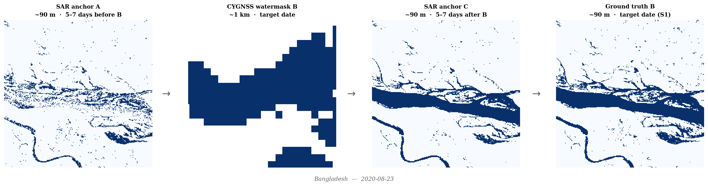
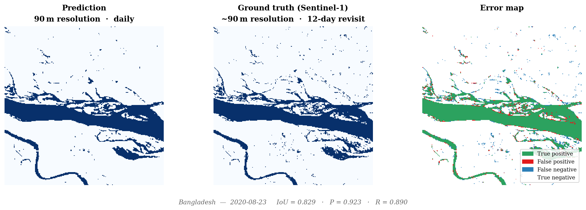
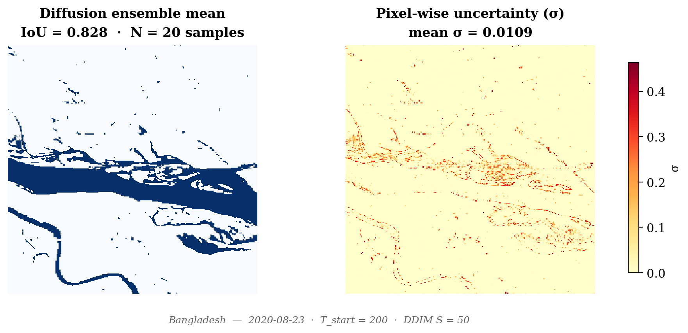

# Daily Flood Mapping at 90 m Resolution Through CYGNSS–SAR Fusion

[](https://doi.org/)
[](LICENSE)
[](https://huggingface.co/)

**Authors:** Gauthier Malandrin, Cynthia Gerlein-Safdi (UC Berkeley Civil & Environmental Engineering Department, Water & Carbon Lab)

This repository provides inference code and pre-trained model weights for our CYGNSS–SAR flood mapping framework, which produces **daily flood maps at 90 m resolution** by fusing GNSS-Reflectometry observations from the NASA CYGNSS constellation with Sentinel-1 SAR temporal anchors.

---

## Overview



Existing satellite flood products face a fundamental spatio-temporal trade-off: SAR missions provide high spatial resolution but revisit any location only every 6–12 days, while CYGNSS offers daily observations but at ~1 km resolution. Our framework bridges this gap by learning to downscale daily CYGNSS flood signals to 90 m resolution using SAR acquisitions from adjacent dates as spatial anchors, conditioned on high-resolution topographic variables from MERIT Hydro.

### Key results
- **IoU = 0.703** on a 47,653-tile test set spanning 7 flood-prone regions across 3 continents
- Outperforms SAR-only state of the art (IoU = 0.67, Misra et al. 2025) despite solving a harder downscaling problem
- Calibrated uncertainty estimates via a conditional diffusion model (ECE = 0.073)
- Designed for direct transfer to the NASA-ISRO NISAR L-band mission

---

## How It Works



Flood observations are organized as temporal triplets (A→B→C), where B is the target date and A, C are SAR acquisitions bracketing B by 5–7 days. A temporal U-Net with three parallel encoding branches and learnable cross-attention gates fuses these inputs into a spatially explicit flood probability map at date B.

---

## Qualitative Results





---

## Installation

```bash
git clone https://github.com/gauthiermalandrin1903/cygnss-sar-flood-mapping.git
cd cygnss-sar-flood-mapping
pip install -r requirements.txt
```

---

## Usage

### Quick start — inference on a single triplet

```python
from inference.predict import FloodPredictor

predictor = FloodPredictor.from_pretrained()

flood_map = predictor.predict(
    sar_a="path/to/s1_flood_A.tif",       # Sentinel-1 flood mask, 5-7 days before B
    cygnss_b="path/to/cygnss_B.nc",        # CYGNSS watermask at target date B
    sar_c="path/to/s1_flood_C.tif",        # Sentinel-1 flood mask, 5-7 days after B
    merit_dir="path/to/merit_hydro/",      # MERIT Hydro directory (DEM, HAND, ACC, TWI)
    region_bbox=(lon_min, lat_min, lon_max, lat_max)
)
```

### With uncertainty quantification (diffusion ensemble)

```python
from inference.predict_ensemble import EnsemblePredictor

predictor = EnsemblePredictor.from_pretrained()

flood_map, uncertainty = predictor.predict(
    sar_a="path/to/s1_flood_A.tif",
    cygnss_b="path/to/cygnss_B.nc",
    sar_c="path/to/s1_flood_C.tif",
    merit_dir="path/to/merit_hydro/",
    region_bbox=(lon_min, lat_min, lon_max, lat_max),
    n_samples=20
)
```

---

## Data Requirements

| Input | Source | Resolution | Notes |
|-------|--------|-----------|-------|
| Sentinel-1 GRD VV | [Copernicus](https://scihub.copernicus.eu/) | ~90 m | Dates A and C, ±5–7 days from target |
| CYGNSS Berkeley-RWAWC | [UC Berkeley](https://www.hydroshare.org/) | ~1 km | Target date B |
| MERIT Hydro | [merit-hydro.org](http://hydro.iis.u-tokyo.ac.jp/~yamadai/MERIT_Hydro/) | 90 m | DEM, HAND, ACC, TWI |

---

## Model Weights

Pre-trained weights are available on HuggingFace:

```python
# Weights are downloaded automatically on first use
predictor = FloodPredictor.from_pretrained()
```

Or download manually:
```bash
# Coming soon
```

---

## Citation

If you use this work, please cite:

```bibtex
@article{malandrin2026flood,
  title={Daily Flood Mapping at 90 m Resolution Through Physically-Constrained CYGNSS--SAR Fusion},
  author={Malandrin, Gauthier and Gerlein-Safdi, Cynthia},
  journal={IEEE Transactions on Geoscience and Remote Sensing},
  note={Under review},
  year={2026}
}
```

---

## License

This project is licensed under the MIT License — see [LICENSE](LICENSE) for details.